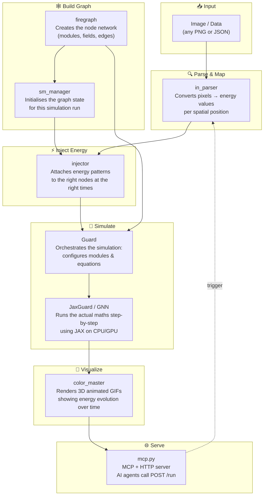
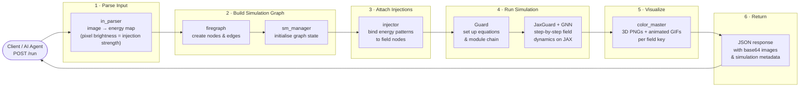
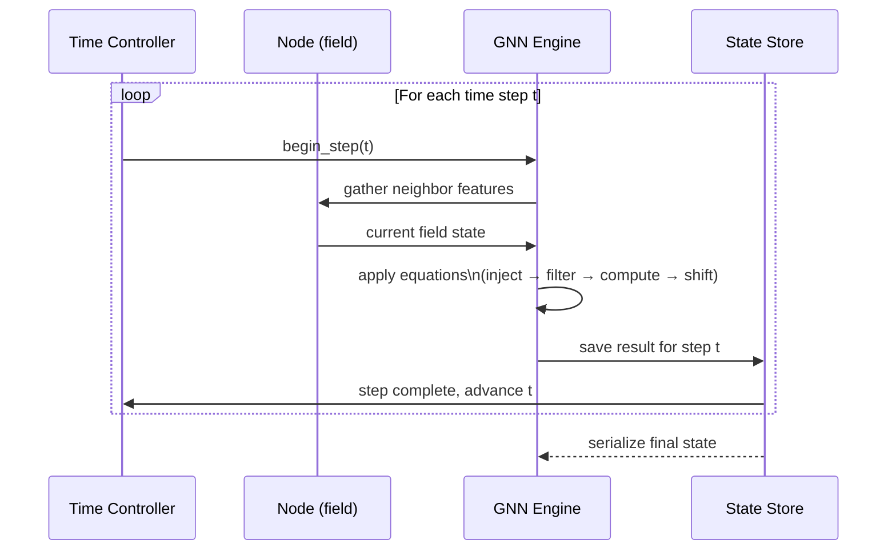

# COR — Field Simulation Engine

> **What is this?**
> COR is a system that simulates how **energy flows and changes over time** inside a network of interconnected nodes — similar to how waves travel through water, or how electrical signals propagate through a circuit. You feed it an image or a set of values, it turns that into an energy pattern, runs a physics-inspired simulation, and produces animated 3D visualizations of the result.

---

## In plain language

Imagine dropping a stone into a pond. Ripples spread out from the impact point, bounce off edges, and gradually fade. COR does something conceptually similar, but in a mathematical/computational space:

1. **You provide an input** — an image, a configuration, or raw data.
2. **COR reads the energy in that input** — bright pixels, high values, and strong signals all become "energy injections."
3. **A network of nodes is built** — think of it as a grid of tiny sensors that can sense, store, and pass on energy.
4. **The simulation runs step-by-step through time** — at each tick, every node updates based on what its neighbors sent it, creating a wave-like evolution.
5. **The results are visualized** as color-coded 3D animations so you can *see* how the energy moved and transformed.
6. **Everything is accessible via a simple API** so AI agents or other tools can trigger runs and receive results programmatically.

---

## System Overview



---

## End-to-End Workflow

The diagram below shows every major stage from receiving a request to returning a result.



---

## Key Components

| Component | What it does (plain English) |
|-----------|------------------------------|
| `in_parser.py` | Reads an image and converts each pixel's brightness into an "energy injection" value at that spatial position |
| `firegraph/` | Builds and manages the graph — the network of nodes, fields, and connections that the simulation runs on |
| `sm_manager/` | Initialises the graph into a ready state before the simulation starts |
| `injector.py` | Takes the energy map produced by the parser and attaches it to the correct nodes in the graph at the right time steps |
| `guard.py` | The main simulation conductor — reads equations, sets up the module chain, and drives the run |
| `jax_test/` | The mathematical engine: a JAX-powered neural-graph network that computes field evolution step by step |
| `color_master/` | Turns raw simulation numbers into beautiful 3D animated color visualizations |
| `mcp.py` | A lightweight HTTP + MCP server so AI agents (Claude, Gemini, OpenAI, …) can trigger runs via `POST /run` |

---

## The Simulation Loop (one step at a time)



---

## Quick Start

### Run via Docker (recommended)

```bash
docker build -t cor .
docker run -p 8080:8080 cor
```

### Call the simulation

```bash
curl -X POST http://localhost:8080/run \
  -H "Content-Type: application/json" \
  -d '{
    "sim_spec": {
      "amount_nodes": 4,
      "sim_time": 10,
      "dims": 3
    }
  }'
```

### Check server health

```bash
curl http://localhost:8080/health
curl http://localhost:8080/status
```

---

## For AI Agents

COR exposes a single MCP tool called **`run`**:

```
Tool:  run
Route: POST /run
```

**Input schema:**

```json
{
  "sim_spec": {
    "amount_nodes": 4,
    "sim_time": 20,
    "dims": 3,
    "user_id": 1
  },
  "injection_file": { ... }
}
```

**Output:** JSON with simulation metadata and base64-encoded visualization images (PNG statics + GIF animations per field key).

Agents supported: **Claude**, **Gemini**, **OpenAI** — see [`AGENTS.md`](AGENTS.md) for details.

---

## Sub-projects

| Folder | Short description |
|--------|------------------|
| [`jax_test/`](jax_test/README.md) | JAX/Flax GNN simulation engine — the mathematical core |
| [`color_master/`](color_master/README.md) | 3D visualization module with its own MCP server |

---

## Philosophy

> *Every state carries the current moment into the next — only the change is computed.*

The grid is not the goal; it is a building block for discovering **persistent patterns over time**. The true aim is to identify those patterns and understand how energy injections shape the next time step.
